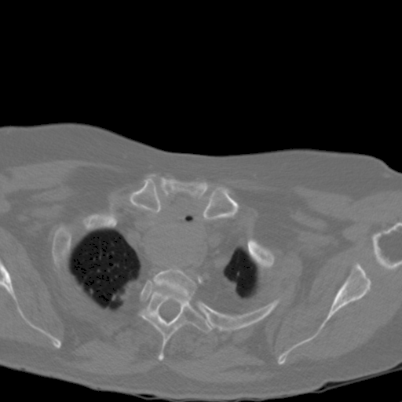
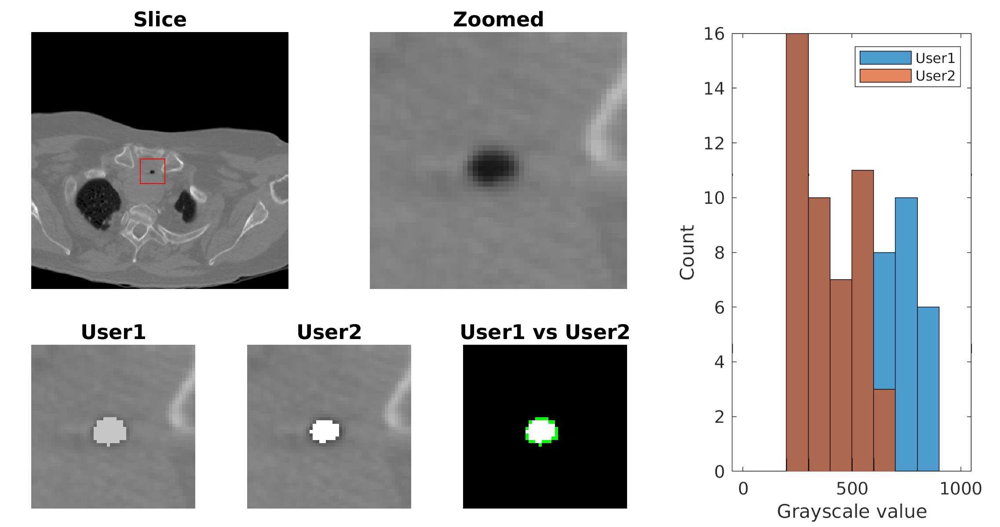

# Compare segmentation

MATLAB script to compare the segmentation done by two different users.

## Data

Example data is included in DICOM form.
The slice is taken from a CT scan of a patient's chest.
It has been anonymised using `dicomanon` in MATLAB.
For information on other metadata, use `dicominfo`.

Two users segmented the trachea volume from the same data using [MIMICS](https://www.materialise.com/en/medical/software/mimics).
The segmentations are exported as masks overlayed on the image slice.

The script `compare.m` prints the following output:

> User1 chose 21 pixels that User2 did not choose
>
> User2 chose 0 pixels that User1 did not choose

It also creates three figures, which we have combined into one example:

